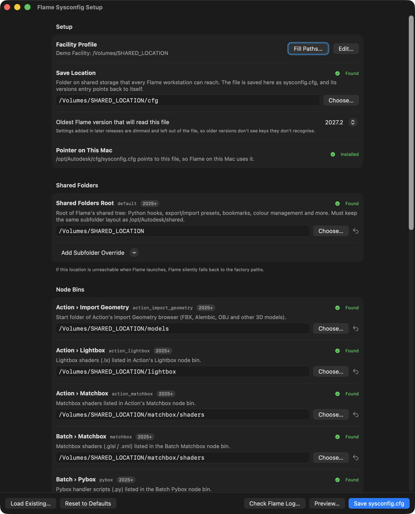
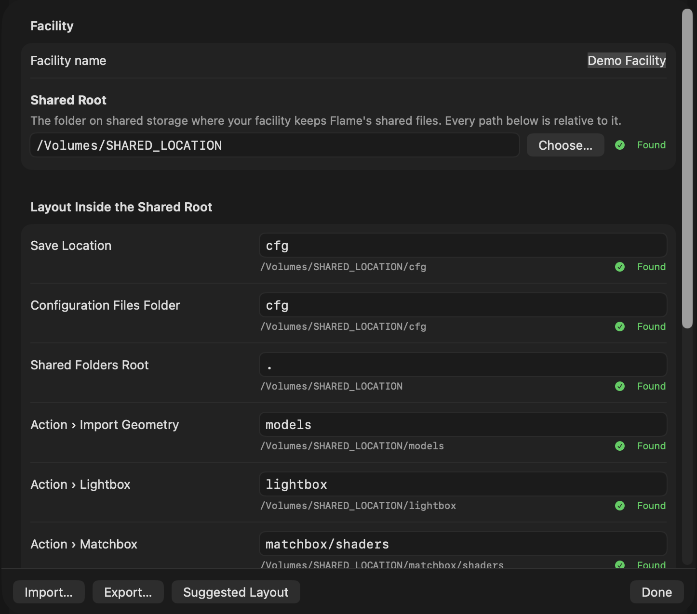
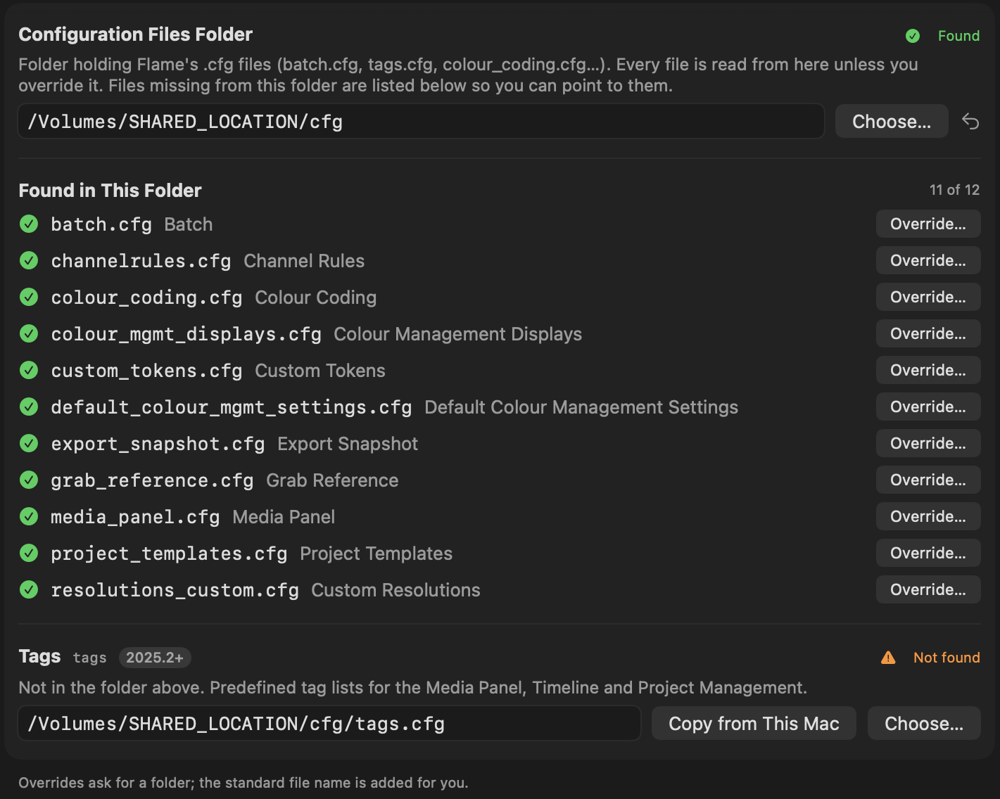
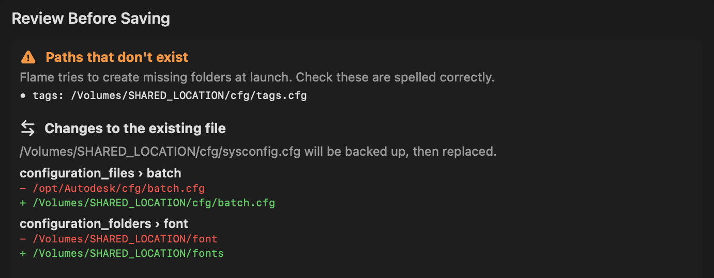

# flame-sysconfig-setup

A macOS app that walks you through building a central `sysconfig.cfg`, so every Flame workstation in a facility shares the same folders, node bins and configuration files.

**Status:** Maintained
**Maintainer:** @BayleyBY

## What it does



Flame can read its shared folders, Matchbox/Lightbox/Pybox bins, configuration files (Batch, tags, colour coding, project templates…) and project defaults from one `sysconfig.cfg` on shared storage (see Flame Help, **"sysconfig.cfg"**). Writing that JSON by hand is error-prone, and one wrong path quietly sends a workstation back to its factory settings.

Flame Sysconfig Setup gives every setting its own row, with a plain-English description, a folder picker and a found / not found check. Then it:

- **fills every path in one click** from a facility profile (your shared root plus where things live inside it), which you can export and import on each workstation
- **reads all your `.cfg` files from one folder**, lists any that are missing, and can copy them from the workstation's `/opt/Autodesk/cfg` or Autodesk's samples
- **reviews the file before saving**: paths that only exist on one Mac, paths that don't exist, and folders missing from the shared layout. When replacing a file, it also shows what will change and backs up the old one.
- **installs the pointer** (`/opt/Autodesk/cfg/sysconfig.cfg`) that sends every Flame version on a workstation to the shared file
- **checks Flame's startup log** to confirm which file Flame used and whether every setting matches
- **keeps up with new Flame releases.** Settings Autodesk adds in a new version are found in that version's default `sysconfig.cfg` and shown as "New in …" rows, and anything it doesn't recognise in an existing file is saved back unchanged.

## Compatibility

Only list combinations that have actually been tested.

| Flame version | macOS | Rocky Linux | Notes |
|---|---|---|---|
| 2027.2 | ✅ | ❌ | Tested with 2027.2 prerelease builds on macOS 26 (Apple silicon) |
| 2027.1 | ✅ | ❌ | |
| 2027 | ✅ | ❌ | |
| 2026 | ✅ | ❌ | Settings added after the chosen version are left out automatically |
| 2025 | ✅ | ❌ | Settings added after the chosen version are left out automatically |

✅ tested and working · ⚠️ works with issues (see Known issues) · ❌ not working · ❔ untested

The app itself needs **macOS 13 or later** (Apple silicon or Intel). It's a macOS app, so it doesn't run on Rocky Linux. A facility with both platforms can give each its own `sysconfig.cfg` using the `<OS>` token; see [Separate files per platform or Flame version](#separate-files-per-platform-or-flame-version).

## Installation

**Download:** get the latest `Flame-Sysconfig-Setup-<version>.dmg` from [Releases](../../releases). Open it and drag **Flame Sysconfig Setup** to **Applications**. The disk image is signed with an Apple Developer ID and notarized by Apple, so it opens like any other Mac app.

Each release also has a `.zip`, built by GitHub Actions straight from the tagged source, for anyone who wants to check a build against the public code. That copy isn't notarized, so macOS blocks it the first time. Right-click it and choose **Open**, or run:

```bash
xattr -dr com.apple.quarantine "/Applications/Flame Sysconfig Setup.app"
```

Every download has a `.sha256` file for checking it, e.g. `shasum -a 256 -c Flame-Sysconfig-Setup-<version>.dmg.sha256`.

**Build from source:** you need the Xcode Command Line Tools (`xcode-select --install`).

```bash
git clone https://github.com/flamelogik/flame-sysconfig-setup.git
cd flame-sysconfig-setup
./build.sh
```

The app is written to `build/Flame Sysconfig Setup.app`. The release builds come from the same script: GitHub Actions runs it for the `.zip` (`.github/workflows/release.yml`), and a maintainer runs it with a Developer ID, then `package_dmg.sh`, for the notarized `.dmg`.

## Usage

1. **Set up your facility profile.** Click **Set Up…** in the Setup section (or Flame Sysconfig Setup → Facility Profile…, ⌘,).
   - Choose your **shared root**, the folder on shared storage where your facility keeps Flame's shared files, e.g. `/Volumes/YourShare/flame`.
   - Adjust where each item lives inside it. The suggested layout is `cfg`, `models`, `lightbox`, `matchbox/shaders`, `pybox` and `fonts`.

   

2. **Fill Paths.** One click sets every path in the window from your profile.
3. **Check the Configuration Files section.** Any `.cfg` missing from your config folder is listed. **Copy from This Mac** copies it from the workstation's `/opt/Autodesk/cfg`, or from Autodesk's sample.

   

4. **Save.** Review anything the app flags, then confirm. When you're replacing a file, the review shows each change.

   

5. **Install Pointer on This Mac.** It needs an administrator password, and any existing file is backed up first.
6. **Repeat step 5 on each workstation.** Mount the share at the same path everywhere. Export your profile (Facility Profile… → **Export…**) to import it on other Macs.
7. **Restart Flame, then click Check Flame Log…** It should say Flame used your shared file, with every setting matching.

Already have a shared `sysconfig.cfg`? Use **Load Existing…** to open and edit it.

**How the pointer works.** Flame reads `/opt/Autodesk/cfg/sysconfig.cfg`, if it exists, before each version's own file. The app writes it with just a redirect:

```json
{
  "configuration": {
    "versions": {
      "<VERSION>": "/Volumes/YourShare/flame/cfg/sysconfig.cfg"
    }
  }
}
```

The shared file points back to itself, so Flame uses its settings. Flame only reads `sysconfig.cfg` at launch, so restart Flame after saving.

### Separate files per platform or Flame version

A pointer can use tokens, so one pointer sends each platform or Flame version to its own file:

```json
{
  "configuration": {
    "versions": {
      "<VERSION>": "/Volumes/YourShare/flame/cfg/<OS>/<MAJOR>/sysconfig.cfg"
    }
  }
}
```

| Token | Becomes | Example |
|---|---|---|
| `<OS>` | the platform, **in lowercase** | `macos`, `linux` |
| `<MAJOR>` | the major version | `2027` |
| `<MINOR>` | the minor version | `1` |
| `<VERSION>` | the full version | `2027.1` |

Flame Help says `<OS>` becomes "macOS or Linux", but Flame really uses lowercase `macos` and `linux`. Name the folders that way, because Linux file systems are case-sensitive. With the pointer above, Flame 2027 on a Mac reads `…/cfg/macos/2027/sysconfig.cfg`, and Flame 2025 on Linux reads `…/cfg/linux/2025/sysconfig.cfg`.

The app doesn't write a pointer like this for you, so create it by hand. It does understand one: the **Pointer on This Mac** row shows which installed Flame versions the pointer sends to the file you're editing, and it won't offer to replace a pointer that already leads there. Use **Load Existing…** to open the file for each platform and version in turn; if you open the pointer itself, the app tells you which files it leads to on this Mac.

The app only changes files when you click **Save**, **Copy from This Mac** or **Install Pointer**, and it backs up anything it replaces with a timestamp.

## Known issues

- The `.zip` build from GitHub Actions isn't notarized, so macOS asks for confirmation the first time it opens (see Installation). The `.dmg` is notarized. It's signed and notarized on a maintainer's Mac rather than in GitHub Actions, because the signing certificate isn't stored in the repo.
- If the shared storage isn't mounted when Flame starts, Flame silently falls back to its factory paths. That's Flame's behaviour, not the app's; **Check Flame Log…** shows when it happens.

## Contributing

Bug reports, testing on other Flame versions, and pull requests are welcome. See the Logik [contributing guide](https://github.com/flamelogik/.github/blob/main/CONTRIBUTING.md).

The most useful contribution right now is testing on an Intel Mac and reporting back.

## Credits and provenance

Written by @BayleyBY for the Logik community, with help from Claude (Anthropic). All code is original to this repository. It uses only Apple's system frameworks (SwiftUI, AppKit), with no third-party code. The app icon is drawn by `tools/make_icon.swift`; its gear is Apple's SF Symbol `gearshape.fill`, rendered at build time.

Thanks to jarak08 on the Logik forum for finding that the `<OS>` token is lowercase, and for the per-platform pointer layout.

Not affiliated with or endorsed by Autodesk. Autodesk and Flame are trademarks of Autodesk, Inc.

## License

[MIT](LICENSE). Part of the [Logik](https://github.com/flamelogik) community tools.
